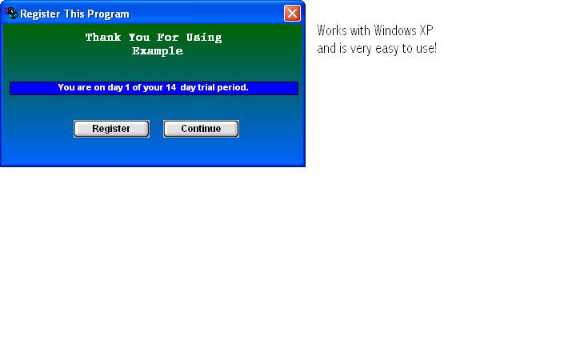



## Cool Registration\*\*UPDATE\*\*

### Description

FIXED ERROR: Encryption. This is a very complex yet very effective and easy to use Registration Program. This program will allow you to put a 14 day trial (change it too what ever you want!) on your program. After 14 days, They have to register it. This uses awsome encryption technology and works great. Has pretty good GUI too! It Comes with a Key Generator and an example on how to use it. NEW UPDATE!!! WOW! This is Amazing Now! It now checks to see if you delete the registry entries of the number of days used, if you did, It KNOWS!!! And it won't let you use the program!!! VERY SMART!! CHECK IT OUT! Enjoy! And please give me feedback! FEB: 10 UPDATED! MORE SECURE!
 
### More Info
 

             |
---                |---
**Submitted On**   |2002-04-05 15:45:48
**By**             |[Joseph Stone](https://github.com/Planet-Source-Code/PSCIndex/blob/master/ByAuthor/joseph-stone.md)
**Level**          |Intermediate
**User Rating**    |4.4 (53 globes from 12 users)
**Compatibility**  |VB 6\.0
**Category**       |[Encryption](https://github.com/Planet-Source-Code/PSCIndex/blob/master/ByCategory/encryption__1-48.md)
**World**          |[Visual Basic](https://github.com/Planet-Source-Code/PSCIndex/blob/master/ByWorld/visual-basic.md)
**Archive File**   |[Cool\_Regis69177452002\.zip](https://github.com/Planet-Source-Code/joseph-stone-cool-registration-update__1-31433/archive/master.zip)

### API Declarations

Check the Zip!

